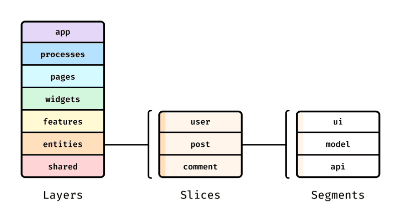

# apps/core-app

### @apps/core-app

### **개요**

- **런타임:** Next.js 15 (App Router), React 19, TypeScript
- **디자인/스타일:** Tailwind CSS v4 + @ci-repo/coreui(토큰/컴포넌트)
- **상태:** React Query(서버 상태), Zustand(클라 상태)
- **핵심 패턴:**
  - FSD(entities → features → widgets → views)로 기능/화면 레이어링
  - ClientLayout에서 전역 Provider/레이아웃(UI 오버레이/사이드바/QueryClient/HTTP) 관리

### **1. FSD 아키텍처**

- Next.js의 pages 폴더와 FSD의 pages layer의 충돌을 방지하기 위해, src/pages → src/views로 이름 변경

[공식 문서 - feature-sliced.design](https://feature-sliced.design/kr/docs/get-started/overview)

[(번역) 기능 분할 설계 - 최고의 프런트엔드 아키텍처](https://emewjin.github.io/feature-sliced-design/)

### **2. ClientLayout (전역 UI/Provider)**

app/client-layout.tsx

**역할:**

- 전역 오버레이/모달 루트(OverlayProvider)
- 전역 HTTP 클라이언트 주입(HttpClientProvider, httpClient 인스턴스)
- React Query 캐시/옵션 제공(QueryClientProvider + Devtools)
- 사이드바 레이아웃/상태(SidebarProvider + AppSidebar)

**패턴:**

- route/page/feature 어디서나 동일한 전역 레이어가 보장되어, 뷰는 기능 구현에만 집중
